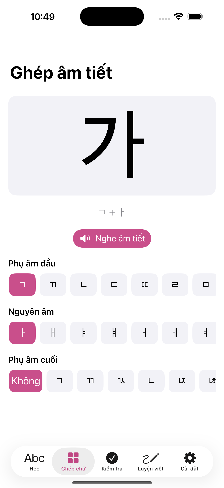

# HangulStudy

Ứng dụng iOS học bảng chữ cái tiếng Hàn (Hangul), viết bằng SwiftUI.

## Ảnh chụp màn hình

### Giao diện sáng

| Học | Ghép chữ | Kiểm tra | Luyện viết | Cài đặt |
|:---:|:---:|:---:|:---:|:---:|
|  |  |  |  |  |

### Giao diện tối

| Học | Kiểm tra | Luyện viết | Cài đặt |
|:---:|:---:|:---:|:---:|
|  |  |  |  |

## Tính năng

- **Onboarding** — 3 trang giải thích Hangul là bảng chữ cái ghép, hiện lần đầu mở app.
- **Học** — lưới 40 chữ cái chia theo nhóm (phụ âm / nguyên âm cơ bản, phụ âm đôi, nguyên âm ghép). Chạm vào chữ để xem tên chữ, cách đọc, từ ví dụ kèm nghĩa. Chữ đã thuộc được đánh dấu.
- **Ghép chữ** — chọn phụ âm đầu + nguyên âm + batchim để tạo khối âm tiết (가, 각, 한…) và nghe cách đọc.
- **Kiểm tra** — trắc nghiệm với 2 chế độ (nhìn chữ → chọn âm, hoặc nghe âm → chọn chữ), lọc theo nhóm hoặc "chữ cần ôn". Có haptic, chấm điểm, và ghi lại tiến độ.
- **Luyện viết** — viết chữ bằng ngón tay hoặc Apple Pencil (PencilKit) theo nét mờ mẫu; nút "Xem cách viết" chạy hoạt hình bút vẽ từng nét đúng thứ tự (dữ liệu nét viết tay cho 24 chữ cơ bản; các chữ còn lại lấy từ đường viền font).
- **Phát âm** — nghe cách đọc từng chữ (đọc theo tên chữ / âm tiết, không phải jamo rời) và từ ví dụ, bằng giọng `ko-KR` của hệ thống. Cảnh báo nếu máy chưa cài giọng tiếng Hàn.
- **Tiến độ + lặp lại ngắt quãng** — mỗi lần trả lời quiz được lưu theo phương pháp Leitner; app lên lịch ôn lại các chữ hay sai. Xem số chữ đã thuộc và xóa tiến độ trong Cài đặt.
- **Song ngữ + sáng/tối** — chuyển giao diện Tiếng Việt ⇄ English, và Sáng / Tối / Theo hệ thống.

## Yêu cầu

- Xcode 16 trở lên
- iOS 17.0 trở lên

## Chạy thử

Mở `HangulStudy.xcodeproj` bằng Xcode rồi bấm Run, hoặc:

```bash
xcodebuild -project HangulStudy.xcodeproj -scheme HangulStudy \
  -sdk iphonesimulator -destination 'platform=iOS Simulator,name=iPhone 17' build

# Chạy test
xcodebuild -project HangulStudy.xcodeproj -scheme HangulStudy \
  -sdk iphonesimulator -destination 'platform=iOS Simulator,name=iPhone 17' test
```

## Cấu trúc

```
HangulStudy/
├── HangulStudyApp.swift          Điểm vào
├── Models/
│   ├── Localization.swift        Chuỗi song ngữ (Bilingual, enum L), AppLanguage, AppAppearance
│   ├── HangulLetter.swift        Model một chữ cái
│   ├── HangulData.swift          Dữ liệu 40 chữ cái + từ ví dụ
│   ├── HangulSyllable.swift      Ghép jamo thành khối âm tiết Unicode
│   ├── HangulStrokes.swift       Nét viết tay (centerline, đúng thứ tự) cho 24 chữ cơ bản
│   └── ProgressStore.swift       Lưu tiến độ + lịch ôn (Leitner)
├── Services/
│   └── SpeechService.swift       Phát âm ko-KR bằng AVSpeechSynthesizer
└── Views/
    ├── RootView.swift            TabView 5 tab + onboarding + giao diện sáng/tối
    ├── OnboardingView.swift      3 trang giới thiệu
    ├── LearnView.swift           Lưới chữ cái theo nhóm
    ├── LetterDetailView.swift    Màn hình chi tiết một chữ
    ├── SyllableBuilderView.swift Ghép âm tiết
    ├── QuizView.swift            Trắc nghiệm 2 chế độ + phạm vi + SRS
    ├── WritingPracticeView.swift Luyện viết bằng PencilKit
    ├── StrokeOrderView.swift     Hoạt hình bút vẽ từng nét (.trim); ưu tiên HangulStrokes, fallback path glyph
    └── SettingsView.swift        Tiến độ + ngôn ngữ + giao diện

HangulStudyTests/                 Swift Testing: HangulData, QuizModel, ProgressStore, HangulSyllable
```

Trạng thái lưu ở `@AppStorage` (`appLanguage`, `appAppearance`, `didOnboard`) và `UserDefaults` (`letterProgress`).
