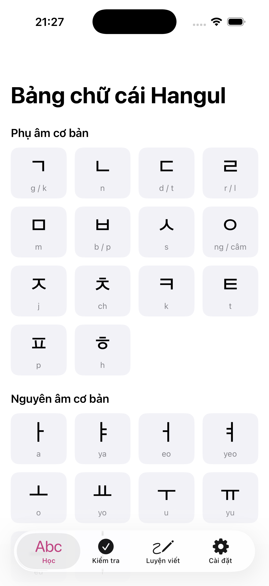
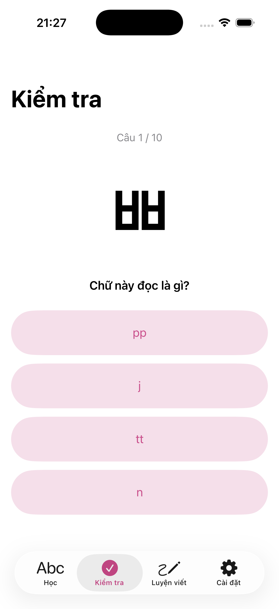
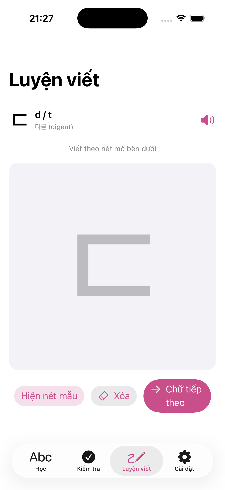
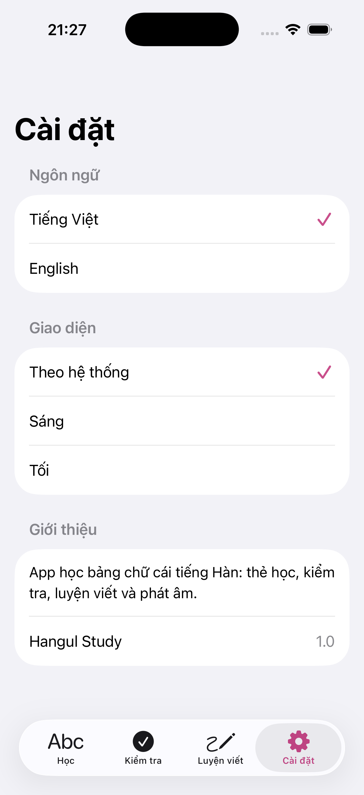
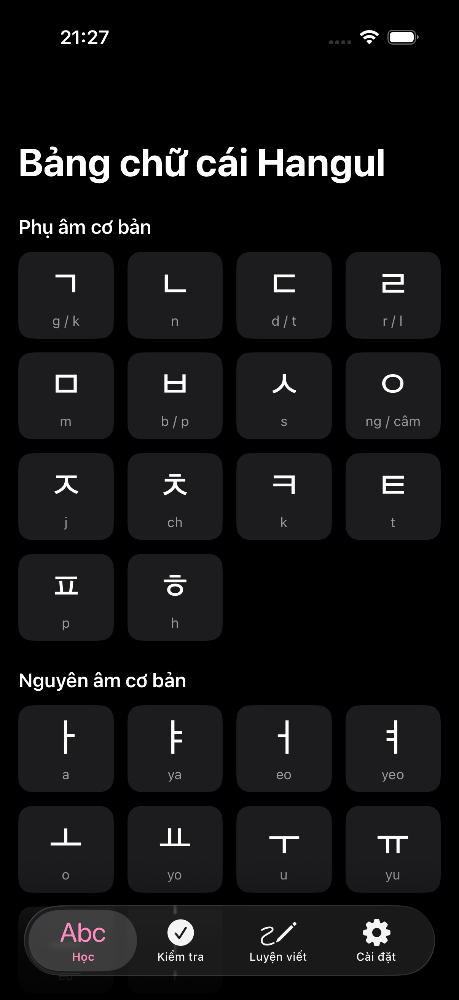
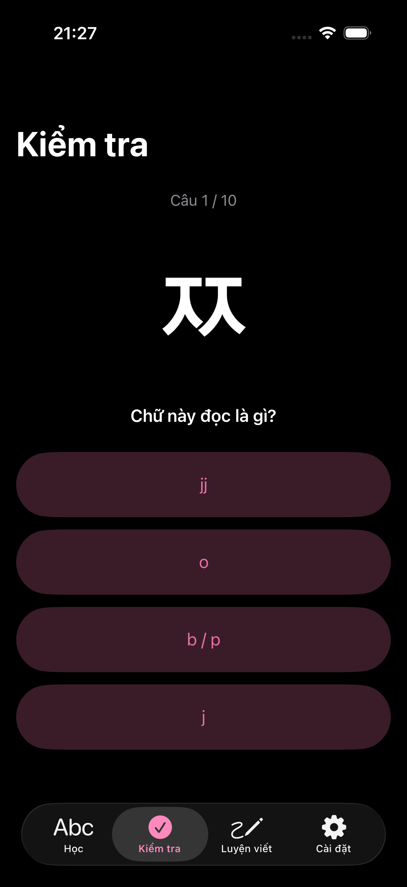
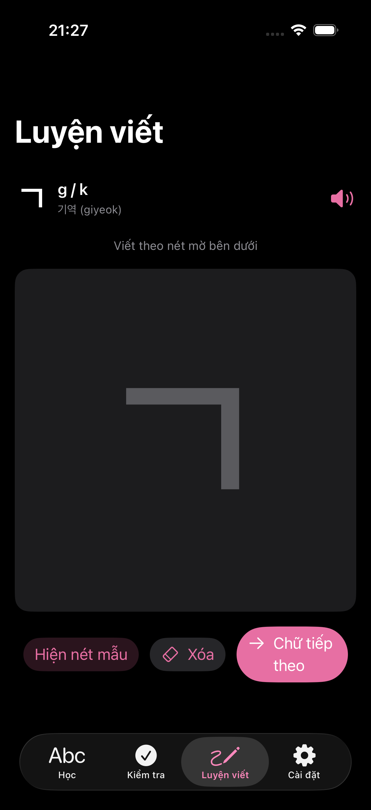
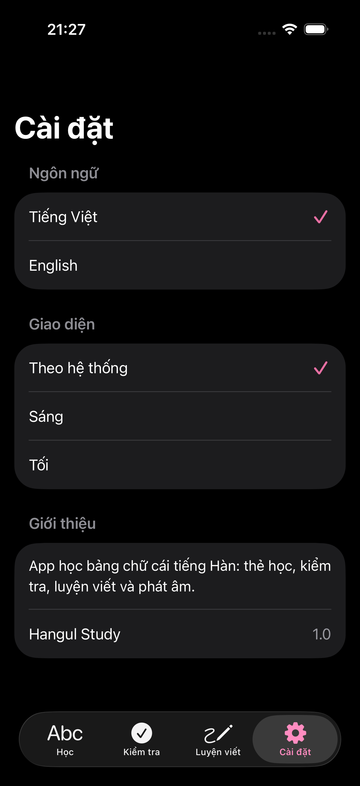

# HangulStudy

Ứng dụng iOS học bảng chữ cái tiếng Hàn (Hangul), viết bằng SwiftUI.

## Ảnh chụp màn hình

### Giao diện sáng

| Học | Kiểm tra | Luyện viết | Cài đặt |
|:---:|:---:|:---:|:---:|
|  |  |  |  |

### Giao diện tối

| Học | Kiểm tra | Luyện viết | Cài đặt |
|:---:|:---:|:---:|:---:|
|  |  |  |  |

## Tính năng

- **Học** — lưới 45 chữ cái chia theo nhóm (phụ âm cơ bản, nguyên âm cơ bản, phụ âm đôi, nguyên âm ghép). Chạm vào chữ để xem chi tiết: tên chữ, cách đọc, từ ví dụ kèm nghĩa.
- **Kiểm tra** — 10 câu trắc nghiệm: nhìn chữ, chọn cách đọc đúng trong 4 phương án, có chấm điểm và làm lại.
- **Luyện viết** — viết chữ bằng ngón tay hoặc Apple Pencil (PencilKit) theo nét mờ mẫu; bật/tắt nét mẫu, xóa, chuyển chữ.
- **Phát âm** — nghe cách đọc từng chữ cái và từ ví dụ bằng giọng tổng hợp `ko-KR` của hệ thống (không cần file âm thanh).
- **Cài đặt** — chuyển ngôn ngữ giao diện Tiếng Việt ⇄ English; chọn giao diện Sáng / Tối / Theo hệ thống.

## Yêu cầu

- Xcode 16 trở lên
- iOS 17.0 trở lên

## Chạy thử

Mở `HangulStudy.xcodeproj` bằng Xcode rồi bấm Run, hoặc:

```bash
xcodebuild -project HangulStudy.xcodeproj -scheme HangulStudy \
  -sdk iphonesimulator -destination 'platform=iOS Simulator,name=iPhone 17' build
```

## Cấu trúc

```
HangulStudy/
├── HangulStudyApp.swift          Điểm vào
├── Models/
│   ├── Localization.swift        Chuỗi song ngữ (Bilingual, enum L), AppLanguage, AppAppearance
│   ├── HangulLetter.swift        Model một chữ cái
│   └── HangulData.swift          Dữ liệu 45 chữ cái + từ ví dụ
├── Services/
│   └── SpeechService.swift       Phát âm ko-KR bằng AVSpeechSynthesizer
└── Views/
    ├── RootView.swift            TabView 4 tab, áp giao diện sáng/tối
    ├── LearnView.swift           Lưới chữ cái theo nhóm
    ├── LetterDetailView.swift    Màn hình chi tiết một chữ
    ├── QuizView.swift            Bài kiểm tra trắc nghiệm
    ├── WritingPracticeView.swift Luyện viết bằng PencilKit
    └── SettingsView.swift        Ngôn ngữ + giao diện
```

Ngôn ngữ giao diện lưu ở `@AppStorage("appLanguage")`, giao diện sáng/tối ở `@AppStorage("appAppearance")`.
